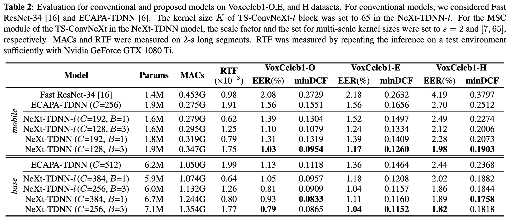

# NeXt-TDNN for Speaker Verification

This repository is the official implementation of "NeXt-TDNN: Modernizing Multi-Scale Temporal Convolution Backbone for Speaker Verification" accepted in ICASSP 2024 [Paper Link](https://arxiv.org/abs/2312.08603)

<p align="center"></p>

## 0. Getting Start

### Prerequisites
This code requires the following:
* lightning == 2.1.2

### Installation

* CUDA, PyToch installation
```
# CUDA
conda install -c "nvidia/label/cuda-11.8.0" cuda

# PyTorch
conda install pytorch torchvision torchaudio pytorch-cuda=11.8 -c pytorch -c nvidia
```
### Data preparation
- [VoxCeleb Dataset](https://www.robots.ox.ac.uk/~vgg/data/voxceleb/index.html#about)
  - To download VoxCeleb dataset fot train/test, execute the command described in the Data preparation section of the [voxceleb_trainer repository](https://github.com/clovaai/voxceleb_trainer)
  - Download [VoxCeleb1-O](https://www.robots.ox.ac.uk/~vgg/data/voxceleb/meta/veri_test2.txt), [VoxCeleb1-E](https://www.robots.ox.ac.uk/~vgg/data/voxceleb/meta/list_test_all2.txt), and [VoxCeleb1-H](https://www.robots.ox.ac.uk/~vgg/data/voxceleb/meta/list_test_hard2.txt)  for test and locate it `data` directory
 
## 1. Model Training
To train ASV model, run main script in train mode. You can select the desired training configuration through config argument.

- to train NeXt-TDNN(C=256, B=3)
```bash
python main.py --mode train --config configs/NeXt_TDNN_C256_B3_K65
```


## 2. Model Test
To test on VoxCeleb1, run the script below. As in training, select the desired test configuration.

<p align="center"></p>

```bash
# VoxCeleb1-O
python main.py --mode test --config configs/NeXt_TDNN_C256_B3_K65

# ⚡ VoxCeleb1-O, VoxCeleb1-E, VoxCeleb1-H
python main.py --mode test_all --config configs/NeXt_TDNN_C256_B3_K65
```


## 3. Reference
- https://github.com/facebookresearch/ConvNeXt-V2
- https://github.com/clovaai/voxceleb_trainer
- https://github.com/mechanicalsea/sugar
- https://github.com/TaoRuijie/ECAPA-TDNN
- https://github.com/speechbrain/speechbrain
- https://github.com/zyzisyz/mfa_conformer


## 4. Citation

If you find our work useful, please refer to 
```
@misc{heo2023nexttdnn,
      title={NeXt-TDNN: Modernizing Multi-Scale Temporal Convolution Backbone for Speaker Verification}, 
      author={Hyun-Jun Heo and Ui-Hyeop Shin and Ran Lee and YoungJu Cheon and Hyung-Min Park},
      year={2023},
      eprint={2312.08603},
      archivePrefix={arXiv},
      primaryClass={eess.AS}
}
```
